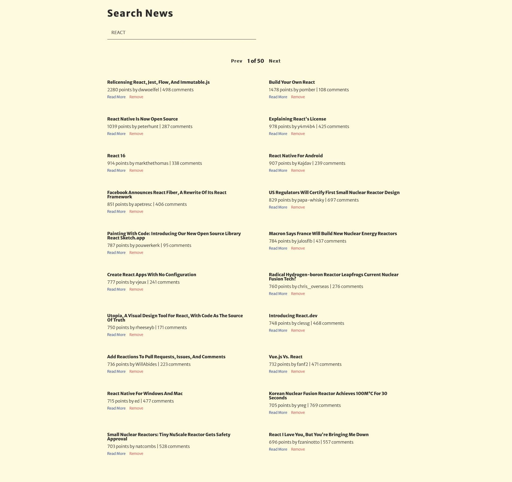

# News Website

## Built with

- React.js
- useContext
- useReducer
- useEffect
- External APIs
- CSS

## Users should be able to:

- Type in a search field and find news articles based on their search queries.
- Click on the "Read More" button to read the full article on the source website.
- Remove news articles that they are not interested in.
- Browse through the 50 available pages of news articles.

## Links

- Live Site URL: [News Website](https://news-website-ekizashvilit.netlify.app/)
